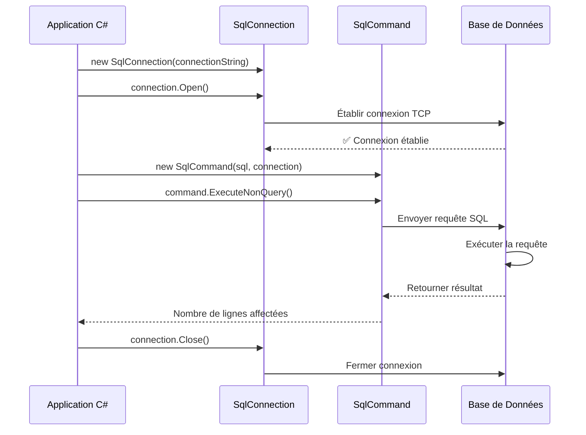

```mermaid
sequenceDiagram
    participant App as Application C#35;
    participant Conn as SqlConnection
    participant Cmd as SqlCommand
    participant DB as Base de Données
    
    App->>Conn: new SqlConnection(connectionString)
    App->>Conn: connection.Open()
    Conn->>DB: Établir connexion TCP
    DB-->>Conn: ✅ Connexion établie
    
    App->>Cmd: new SqlCommand(sql, connection)
    App->>Cmd: command.ExecuteNonQuery()
    Cmd->>DB: Envoyer requête SQL
    DB->>DB: Exécuter la requête
    DB-->>Cmd: Retourner résultat
    Cmd-->>App: Nombre de lignes affectées
    
    App->>Conn: connection.Close()
    Conn->>DB: Fermer connexion
```